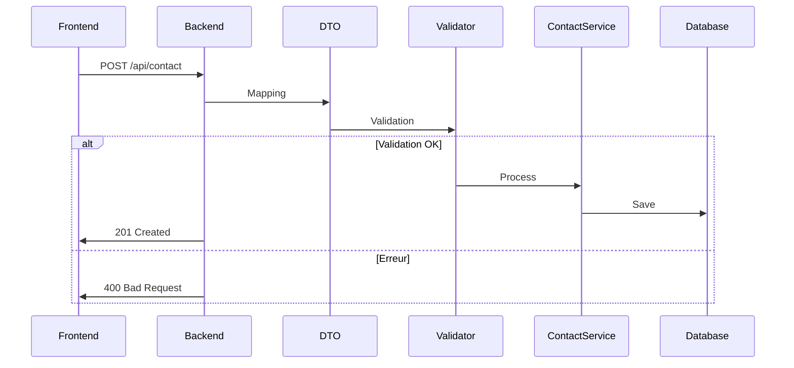

# Formulaire de Contact Dynamique

## Objectif
Créer un formulaire de contact entièrement configurable via l'interface EasyAdmin, avec stockage structuré des soumissions, validation robuste et notifications automatisées.

## Fonctionnalités principales

### 1. Configuration via EasyAdmin
- [ ] Entité SectionContact avec champs :
  - `title` (string)
  - `subtitle` (text)
  - `form_config` (json)
- [ ] Interface de configuration des champs dans EasyAdmin :
  - Type de champ (text, email, tel, select, textarea)
  - Libellé
  - Placeholder
  - Obligatoire
  - Options pour les selects

### 2. Entité Contact
```php
#[ORM\Entity]
class Contact
{
    #[ORM\Id]
    #[ORM\GeneratedValue]
    #[ORM\Column]
    private ?int $id = null;

    #[ORM\Column(length: 255)]
    private string $name;

    #[ORM\Column(length: 255)]
    private string $email;

    #[ORM\Column(length: 20, nullable: true)]
    private ?string $phone = null;

    #[ORM\Column(length: 255)]
    private string $subject;

    #[ORM\Column(type: Types::TEXT)]
    private string $message;

    #[ORM\Column]
    private \DateTimeImmutable $submittedAt;

    #[ORM\Column]
    private bool $consent;
}
```

### 3. DTO et Validation
- [ ] Créer ContactDto avec contraintes de validation
- [ ] Validation des groupes pour différents contextes
- [ ] Validation asynchrone via UX Components

### 4. Service de traitement
```php
class ContactService
{
    public function process(ContactDto $dto): void
    {
        // Mapping DTO -> Entité
        // Persistance
        // Dispatch d'événement
    }
}
```

### 5. Composant Twig (UX)
- [ ] Component ContactForm
- [ ] Template dynamique basé sur la configuration JSON
- [ ] Gestion des états (loading, success, error)

### 6. Workflow de soumission


### 7. Notifications
- [ ] Événement Symfony ContactSubmittedEvent
- [ ] Envoi d'email immédiat
- [ ] Notification Slack optionnelle

### 8. Backoffice
- [ ] CRUD des soumissions dans EasyAdmin
- [ ] Export CSV
- [ ] Recherche/filtres avancés

### 9. RGPD
- [ ] Consentement explicite
- [ ] Politique de rétention (30 jours)
- [ ] Endpoint d'export/désinscription

## Étapes d'implémentation

1. **Modèles de données** (1h)
   - Entité Contact
   - Migration Doctrine
   - DTO de validation

2. **Configuration EasyAdmin** (2h)
   - Entité SectionContact
   - Interface de configuration JSON
   - CRUD des soumissions

3. **Composant frontend** (3h)
   - UX Twig Component
   - Rendu dynamique des champs
   - Validation AJAX

4. **API de soumission** (2h)
   - Controller dédié
   - Gestion des erreurs
   - Réponses normalisées

5. **Services backend** (2h)
   - ContactService
   - ContactEventSubscriber
   - Intégration SMTP

6. **Tests** (2h)
   - Unitaires (service, validation)
   - Fonctionnels (controller)
   - E2E (soumission complète)
